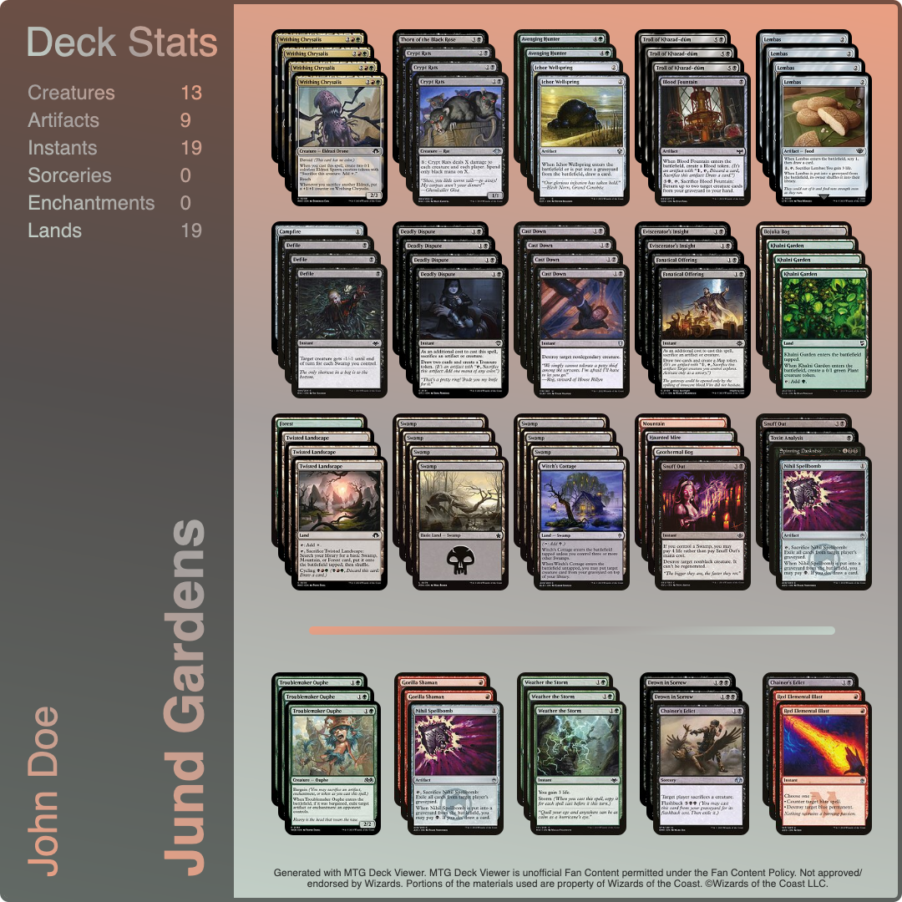

# 🃏 MTG Deck View

> A small tool to visually render 60 card MTG decks in 1080 x 1080 pixels to then export them as PNG files.

> MTG Deck View is unofficial Fan Content permitted under the Fan Content Policy.
> Not approved/endorsed by Wizards. Portions of the materials used are
> property of Wizards of the Coast. ©Wizards of the Coast LLC.

## 📷 Examples

 
    
Example 1

    

 
    
Example 2

    

## 📝 Attribution

#### Scryfall

The images of the cards are retrieved from Scryfall. See their website [here](https://scryfall.com/).

#### modern-screenshot

The render is exported as PNG by modern-screenshot . See their repository [here](https://github.com/qq15725/modern-screenshot)
and their license [here](https://github.com/qq15725/modern-screenshot/blob/main/LICENSE).

## 📜 License

The scripts and documentation in this project are released under the following license

